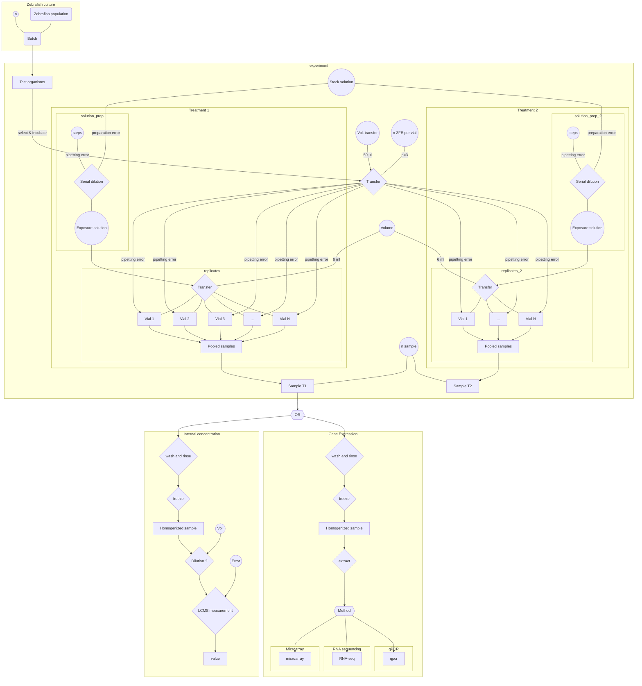

## The data generation process

### Schüttler data

gene expression
The LC25, modeled from experimental observations served as highest and the LC0.5 as lowest exposure concentration with 6 equal dilution steps in between, with dilution steps 1,2,4 and 6 chosen for exposure.

Parameters

+ n_steps_t1 = 1
+ n_steps_t2 = 2
+ n_steps_t3 = 4
+ n_steps_t4 = 6